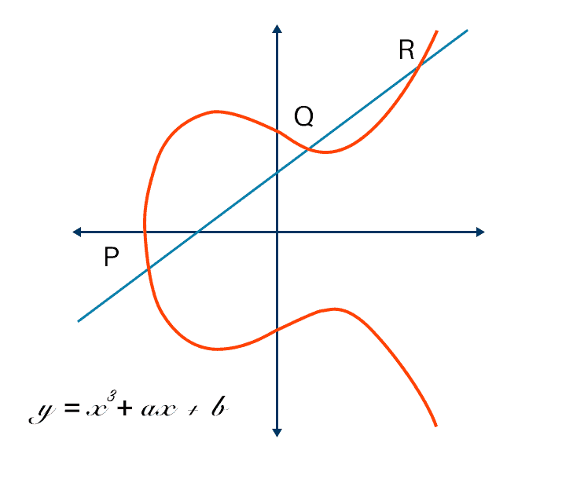

# Sieve of Erastothenes

## Diffie-Helman, RSA and Prime factorisation

* no efficient mechanism to test a prime on a classical computer
* sub-exponential time is required

### RSA 2048

```
2519590847565789349402718324004839857142928212620403202777713783604366202070
7595556264018525880784406918290641249515082189298559149176184502808489120072
8449926873928072877767359714183472702618963750149718246911650776133798590957
0009733045974880842840179742910064245869181719511874612151517265463228221686
9987549182422433637259085141865462043576798423387184774447920739934236584823
8242811981638150106748104516603773060562016196762561338441436038339044149526
3443219011465754445417842402092461651572335077870774981712577246796292638635
6373289912154831438167899885040445364023527381951378636564391212010397122822
120720357
```

## Shors Algorithm

* Peter Shor discovered a quantum algorithm in 1994 for finding the factors of an integer.
* Runs in polynominal time (log N)
* Currently constrained by quantum hardware

## Eliptic Curve

* takes advantage of uncountable infinity
* ECDSA (Eliptic Curve Digital Signature algorithm)

